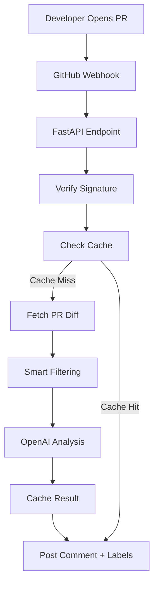

# 🛡️ PR-Agent: AI Code Summarizer

> Stop wasting 15 minutes deciphering what a PR does. Let AI do the heavy lifting.

[](https://www.python.org/)
[](https://fastapi.tiangolo.com/)
[](https://openai.com/)
[](LICENSE)

## 📸 Demo


**Before:** A messy PR with 15 files changed and vague description
**After:** A clean 3-bullet summary with labels, review time, and suggestions

---

## 🚀 Quick Start

### Prerequisites

* Python 3.11+
* Docker & Docker Compose (optional)
* OpenAI API Key
* GitHub Personal Access Token

### Installation

#### 1. Clone the repository

```bash
git clone https://github.com/mefaisalraheem/pr-agent.git
cd pr-agent
```

#### 2. Copy environment variables

```bash
cp .env.example .env
```

#### 3. Configure `.env`

```env
OPENAI_API_KEY=sk-...
GITHUB_TOKEN=ghp_...
GITHUB_WEBHOOK_SECRET=your_secret
```

#### 4. Run with Docker Compose

```bash
docker-compose up -d
```

#### 5. Or run locally

```bash
pip install -r requirements.txt
uvicorn src.main:app --host 0.0.0.0 --port 8000
```

---

## 🔧 Configuration

### Environment Variables

| Variable                | Description                     | Default                          |
| ----------------------- | ------------------------------- | -------------------------------- |
| `OPENAI_API_KEY`        | Your OpenAI API key             | Required                         |
| `OPENAI_MODEL`          | OpenAI model to use             | `gpt-4-turbo-preview`            |
| `OPENAI_TEMPERATURE`    | Response randomness (0.0–1.0)   | `0.3`                            |
| `GITHUB_TOKEN`          | GitHub Personal Access Token    | Required                         |
| `GITHUB_WEBHOOK_SECRET` | Webhook secret for verification | Required                         |
| `REDIS_URL`             | Redis connection URL            | `redis://redis:6379/0`           |
| `EXCLUDE_FILE_PATTERNS` | Files to exclude from analysis  | `package-lock.json,*.min.js,...` |

---

## 🎯 Features

* ✅ **3-Bullet Summary** — Concise overview of PR changes
* ✅ **Breaking Change Detection** — Identify breaking changes automatically
* ✅ **Review Time Estimation** — Estimate how long the review will take
* ✅ **Reviewer Suggestions** — Suggest reviewers based on code areas
* ✅ **Smart Labeling** — Auto-label PRs such as `bugfix`, `feature`, and `enhancement`
* ✅ **Redis Caching** — Cache results to avoid unnecessary re-analysis
* ✅ **Rate Limiting** — Protect against abuse
* ✅ **Error Handling** — Graceful failure with retry logic
* ✅ **Production Ready** — Docker, logging, health checks, and more

---

## 🔄 How It Works



The workflow receives the pull request event through a GitHub webhook, verifies the request, checks Redis for an existing analysis, processes the PR diff when necessary, sends the filtered changes for AI analysis, caches the result, and publishes the review back to GitHub.

---

## 🧪 Testing

Run the test suite with coverage:

```bash
# Install development dependencies
pip install -r requirements-dev.txt

# Run all tests
pytest tests/ -v --cov=src --cov-report=html

# Run a specific test file
pytest tests/unit/test_diff_parser.py -v
```

---

## 📈 Performance

| Metric                | Value              |
| --------------------- | ------------------ |
| Average Response Time | 2–5 seconds        |
| OpenAI Token Usage    | ~200–400 tokens/PR |
| Cost per PR           | ~$0.005–$0.01      |
| Cache Hit Rate        | ~70% with Redis    |
| Time Saved per PR     | 10–15 minutes      |

> Performance and cost figures depend on PR size, model selection, prompt configuration, and cache effectiveness.

---

## 💰 Economics

The bot is designed for teams processing approximately 50 PRs per month.

* **Estimated OpenAI Cost:** ~$5/month
* **Potential Time Saved:** ~10 hours/week
* **ROI:** Significant developer time savings 🚀

Actual costs vary depending on the OpenAI model, token usage, and PR size.

---

## 🐛 Troubleshooting

### 1. Webhook signature verification fails

Make sure:

* `GITHUB_WEBHOOK_SECRET` matches the secret configured in GitHub.
* The secret is configured both in GitHub webhook settings and `.env`.
* The webhook endpoint is receiving the correct GitHub signature headers.

### 2. Redis connection fails

Check that Redis is running:

```bash
docker-compose ps redis
```

Verify your `.env` configuration:

```env
REDIS_URL=redis://redis:6379/0
```

### 3. OpenAI API rate limits

Check your OpenAI API usage and account limits.

> Increasing `OPENAI_TEMPERATURE` does **not** solve API rate-limit problems. Temperature controls response randomness, not API throughput.

---

## 🤝 Contributing

1. Fork the repository.
2. Create a feature branch.
3. Make your changes.
4. Add or update tests.
5. Run the test suite.
6. Submit a pull request.

Example:

```bash
git checkout -b feature/my-new-feature

# Make your changes

pytest tests/ -v

git add .
git commit -m "feat: add new feature"
git push origin feature/my-new-feature
```

---

## 📝 License

MIT License — see the [LICENSE](LICENSE) file for details.

---

## 🙏 Acknowledgments

* Built with [FastAPI](https://fastapi.tiangolo.com/)
* Powered by [OpenAI](https://openai.com/)
* Inspired by the need to make code reviews faster and more efficient

---

## 🚀 Deployment

### Docker Deployment

```bash
# Clone the repository
git clone https://github.com/mefaisalraheem/pr-agent.git
cd pr-agent

# Build and start the application
docker-compose up -d --build

# Check application logs
docker-compose logs -f app

# Run tests inside the container
docker-compose exec app pytest tests/ -v

# Stop all services
docker-compose down
```

---

## 🔒 Security Checklist

* ☑ Environment variables used for secrets
* ☑ GitHub webhook signature verification
* ☑ Rate limiting
* ☑ Non-root user in Docker
* ☑ Input validation with Pydantic
* ☑ Error handling without sensitive data exposure
* ☑ HTTPS in production
* ☑ Logging without sensitive information

---

## 📊 Monitoring Commands

### Check application health

```bash
curl http://localhost:8000/health
```

### View application logs

```bash
docker-compose logs -f app
```

### Check Redis status

```bash
docker-compose exec redis redis-cli ping
```

Expected response:

```text
PONG
```

### Clear Redis cache

```bash
docker-compose exec redis redis-cli FLUSHALL
```

---

## ❤️ Made With

**PR-Agent** is built to eliminate repetitive PR-reading work and give developers a fast, structured understanding of code changes.

Made with ❤️ by **Malik Faisal Raheem**
